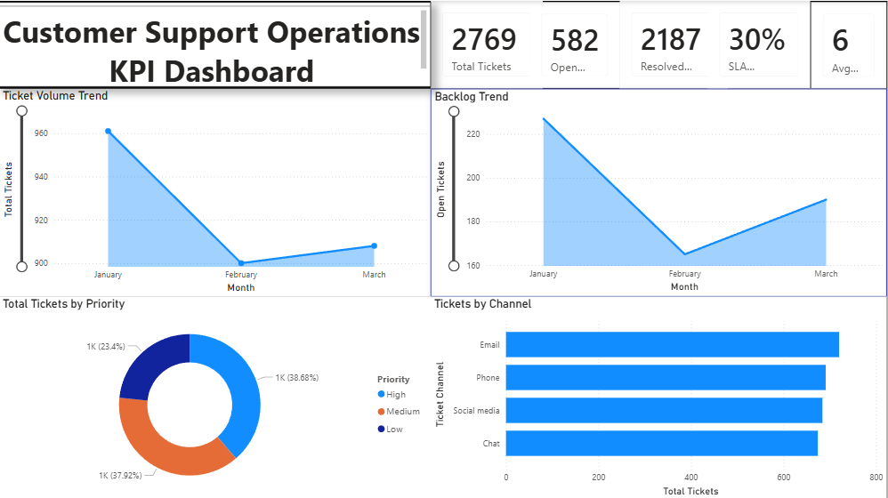

# Customer Support Operations KPI Dashboard

## 📊 Project Overview
This project presents an executive-level Power BI dashboard designed to monitor and analyse customer support operations.  
The dashboard helps stakeholders track ticket volumes, backlog trends, resolution efficiency, and SLA performance.

The focus of this project is on **business insights and operational KPIs**, rather than advanced analytics or machine learning.

---

## 🎯 Business Objective
Customer support teams need clear visibility into:
- Incoming ticket volumes
- Open vs resolved tickets
- Resolution efficiency
- SLA compliance
- Priority and channel distribution

This dashboard provides a single, decision-ready view to support operational planning and performance monitoring.

---

## 🛠 Tools & Technologies
- **Power BI** – Data modelling, DAX measures, and dashboard development  
- **DAX** – KPI calculations (tickets, backlog, SLA, resolution time)  
- **Excel / CSV** – Source dataset  

---

## 📈 Key KPIs
- Total Tickets  
- Open Tickets (Backlog)  
- Resolved Tickets  
- Average Resolution Time (Days)  
- SLA Compliance (%)  

---

## 📊 Dashboard Features
- Executive KPI summary
- Monthly ticket volume trend
- Backlog trend over time
- Ticket distribution by priority
- Ticket distribution by support channel

---

## 💡 Key Insights
- Ticket volumes fluctuate month-to-month, indicating varying workload pressure
- Backlog trends highlight periods of increased operational strain
- SLA compliance is impacted by higher average resolution times
- Channel-level breakdown supports better resource allocation

---

## 📷 Dashboard Preview

---

## 🔎 Notes
- This project focuses on **operational reporting and BI storytelling**
- The dataset is simulated/public and used for demonstration purposes
- Future enhancements may include automated data refresh using Python

---

## 📬 Contact
**Ardhra C K**  
Business Intelligence / Business Analyst  

